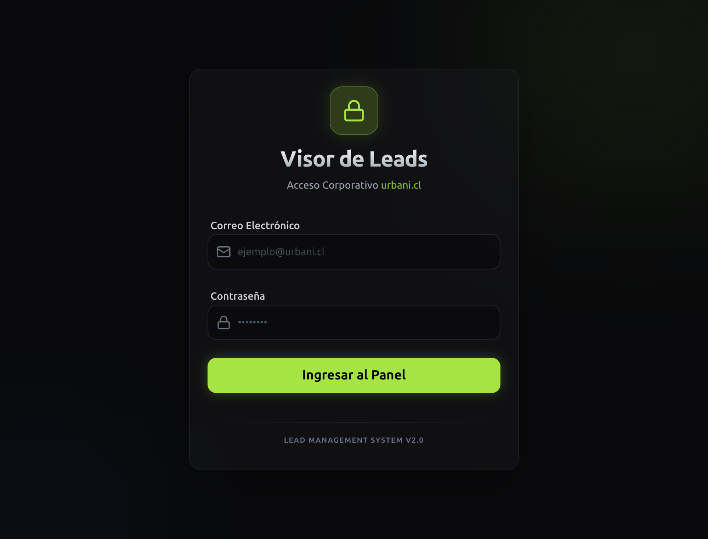

# Manual Completo para Ejecutivos — Visor de Leads Urbani

**Versión:** 1.0  
**Fecha:** 2026-03-02  
**Perfil objetivo:** Ejecutivo comercial

---

## 1) Objetivo del sistema
El Visor de Leads te permite:
- ver tus leads asignados,
- priorizar contacto,
- registrar gestión comercial,
- programar próximos seguimientos,
- mantener trazabilidad del historial de cada lead.

La meta operativa es simple: **contactar más rápido, registrar mejor y no perder seguimiento**.

---

## 2) Acceso al sistema
### URL
- `http://100.113.97.20:3000` (entorno actual)

### Pantalla de login

### Pasos
1. Ingresa tu correo corporativo.
2. Ingresa tu contraseña.
3. Presiona **Ingresar al Panel**.

---

## 3) Flujo de trabajo recomendado (ejecutivo)
Usa siempre este orden:

1. **Entrar a tu cola de leads** (panel V3).
2. **Tomar lead prioritario** (nuevo/sin gestión reciente).
3. **Intentar contacto** (llamada, WhatsApp o correo).
4. **Registrar resultado real** (estado + motivo + nota).
5. **Programar próximo contacto** (si corresponde).
6. **Guardar + Siguiente** para mantener ritmo.
7. Repetir ciclo.

> Regla de oro: **si no está registrado, no ocurrió**.

---

## 4) Estados de gestión (uso práctico)
> Los nombres pueden variar levemente por versión, pero la lógica es esta.

- **No Gestionado / Nuevo:** lead aún sin contacto real.
- **Por Contactar:** primer intento pendiente.
- **En Proceso:** ya hay conversación activa.
- **Visita:** lead con visita agendada/realizada.
- **Venta Cerrada:** lead convertido.
- **No Efectivo / Perdido:** lead descartado (dejar motivo claro).

### Buenas prácticas al cambiar estado
- Siempre dejar **nota breve y específica**.
- Si no cerraste, deja **fecha de próximo paso**.
- Evita notas genéricas como “llamé” sin contexto.

---

## 5) Quick Actions (si están habilitadas)
Acciones rápidas típicas:
- **No contesta**
- **Número inválido**
- **Contactado**
- **Agendar**
- **Perdido**

Úsalas para velocidad, pero revisa que:
- el estado final sea el correcto,
- la nota tenga contexto,
- quede próximo paso cuando aplica.

---

## 6) Registro de notas efectivas
Formato recomendado (30–60 segundos):

- **Contacto:** llamada / WhatsApp / correo
- **Resultado:** contestó / no contestó / interesado / no califica
- **Dato clave:** renta, proyecto de interés, objeción principal
- **Próximo paso:** fecha + canal

**Ejemplo:**
> “Llamada 14:20. Cliente interesado en Vista Parque, renta aprox 1.8M. Pide simulación. Envío correo hoy y recontacto mañana 11:00 por WhatsApp.”

---

## 7) Gestión diaria sugerida (rutina)
### Inicio de jornada (15 min)
- Revisar pendientes de hoy.
- Priorizar leads vencidos o sin gestión.

### Bloques comerciales
- Trabajar en tandas de 45–60 minutos.
- Objetivo: cerrar ciclo de cada lead (contacto + registro + próximo paso).

### Cierre del día (10 min)
- Revisar que no queden leads sin estado actualizado.
- Confirmar agenda de seguimientos para mañana.

---

## 8) Errores frecuentes y cómo evitarlos
1. **No registrar después de contactar**
   - Solución: siempre guardar antes de pasar al siguiente lead.

2. **Dejar estado ambiguo**
   - Solución: estado coherente + motivo + nota concreta.

3. **No agendar próximo contacto**
   - Solución: cada lead activo debe tener próxima acción.

4. **Notas largas sin estructura**
   - Solución: usa formato breve: Resultado + Dato clave + Próximo paso.

---

## 9) Checklist operativo del ejecutivo
Usa este checklist todos los días:

- [ ] Ingresé al sistema
- [ ] Revisé mi cola de leads
- [ ] Contacté leads prioritarios
- [ ] Registré todas las gestiones
- [ ] Dejé próximos contactos agendados
- [ ] Cerré el día sin leads “colgados”

---

## 10) Troubleshooting rápido
### No puedo iniciar sesión
- Verifica correo/contraseña.
- Revisa bloqueo por muchos intentos.
- Si persiste, reporta a admin con hora exacta del error.

### No carga panel / datos
- Actualiza navegador (Ctrl+F5).
- Verifica conexión de red.
- Reporta captura de pantalla + hora + acción que estabas haciendo.

### Botón no responde / error al guardar
- Copia la nota antes de reintentar.
- Refresca y vuelve a abrir el lead.
- Si persiste, reporta lead afectado + mensaje de error.

---

## 11) Escalamiento interno
Cuando algo falle, reporta con este formato:
- **Módulo:** (login, panel V3, carga, etc.)
- **Acción:** qué intentabas hacer
- **Lead/ID:** si aplica
- **Hora exacta:** HH:MM
- **Evidencia:** captura de pantalla

---

## 12) Nota de versiones
Este manual está orientado a operación ejecutiva del **Visor de Leads V3**.  
Se actualizará cuando cambie flujo, estados o pantallas.
